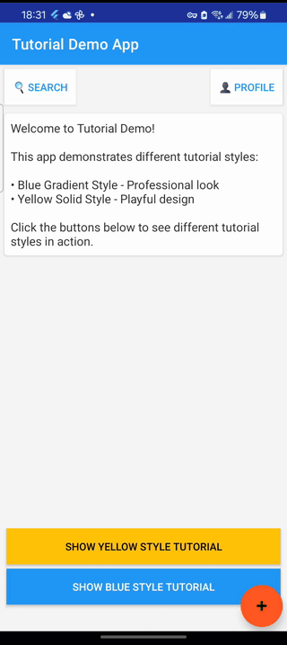

# Android 新手教程庫 [](https://jitpack.io/#ImL1s/android-tutorial-lib)

[English](README.md) | 中文

一個功能強大、高度可自定義的 Android 新手引導庫，支持多種視覺風格和靈活的觸發方式。

## 特性

- 🎨 **高度可自定義** - 支持自定義顏色、樣式、形狀、動畫效果
- 🎯 **靈活的目標定位** - 通過 View ID 或 Tag 查找目標視圖
- 📐 **多種高亮形狀** - 圓形、矩形、圓角矩形
- 🌈 **漸變支持** - 提示框和按鈕支持漸變色效果
- 💾 **狀態管理** - 自動記錄教程顯示狀態，支持按用戶管理
- 🎭 **多種觸發方式** - 手動觸發、首次啟動、事件觸發
- 📱 **兼容性** - 支持 Android 5.0 (API 21) 及以上版本
- 🚀 **輕量級** - 核心庫體積小，無冗余依賴

## 演示



## 原理說明

本庫通過以下步驟實現新手引導效果：

1. **視圖定位**：通過 View ID 或 Tag 在視圖樹中查找目標視圖
2. **坐標計算**：獲取目標視圖在屏幕上的絕對坐標
3. **截圖處理**：對當前界面進行截圖並添加半透明遮罩層
4. **高亮繪制**：在遮罩層上清除目標區域，並繪制高亮邊框
5. **提示展示**：在合適位置繪制提示文字框，並用連接線指向目標
6. **交互處理**：全屏 DialogFragment 展示處理後的圖像，支持點擊關閉

## 安裝

### Gradle

添加 JitPack 仓库配置：

```gradle
allprojects {
    repositories {
        ...
        maven { url 'https://jitpack.io' }
    }
}
```

添加依赖项：

```gradle
dependencies {
    implementation 'com.github.ImL1s:android-tutorial-lib:Tag'
}
```

> **注意：** 请将 'Tag' 替换为实际的版本标签（如 '1.0.0'）或提交哈希。

### Maven

添加 JitPack 仓库配置：

```xml
<repositories>
    <repository>
        <id>jitpack.io</id>
        <url>https://jitpack.io</url>
    </repository>
</repositories>
```

添加依赖项：

```xml
<dependency>
    <groupId>com.github.ImL1s</groupId>
    <artifactId>android-tutorial-lib</artifactId>
    <version>Tag</version>
</dependency>
```

> **注意：** 请将 'Tag' 替换为实际的版本标签（如 '1.0.0'）或提交哈希。

## 使用方法

### 基本使用

```kotlin
// 創建並顯示教程
val tutorialManager = TutorialManager.builder(this)
    .steps {
        step {
            target(R.id.search_button)      // 通過 ID 定位
            text("點擊這裡進行搜索")
            maxWidth(100f)                  // 提示框最大寬度（dp）
        }
        step {
            targetTag("settings_tag")       // 通過 Tag 定位
            text("這裡是設置選項")
            shape(HighlightShape.CIRCLE)    // 圓形高亮
        }
    }
    .build()

// 顯示教程
tutorialManager.show()
```

### 藍色漸變風格（企業應用風格）

```kotlin
TutorialManager.builder(this)
    .config {
        tutorialId("home_tutorial")
        showOnlyOnce(true)                  // 只顯示一次
        overlayColor(0xD0000000.toInt())    // 遮罩層顏色
        style(TutorialStyle(
            highlightBorderColor = Color.parseColor("#2B44B1"),
            highlightBorderWidthDp = 2f,
            highlightCornerRadiusDp = 4f,
            tooltipStyle = TooltipStyle.GRADIENT,
            tooltipColors = listOf(
                Color.parseColor("#2B44B1"),
                Color.parseColor("#015BE2")
            ),
            tooltipTextColor = Color.WHITE,
            tooltipCornerRadiusDp = 100f,
            connectorLineStyle = LineStyle.DASHED,
            buttonText = "知道了",
            buttonStyle = ButtonStyle.GRADIENT_BLUE
        ))
    }
    .steps {
        step {
            target(R.id.search_button)
            text("點擊這裡搜索內容")
            maxWidth(100f)
        }
    }
    .build()
    .show()
```

### 黃色實色風格（活潑應用風格）

```kotlin
TutorialManager.builder(this)
    .config {
        style(TutorialStyle(
            highlightBorderColor = Color.parseColor("#F7B500"),
            tooltipStyle = TooltipStyle.SOLID,
            tooltipColors = listOf(Color.parseColor("#F7B500")),
            tooltipTextColor = Color.BLACK,
            connectorLineStyle = LineStyle.SOLID,
            buttonText = "我知道了",
            buttonStyle = ButtonStyle.SOLID_YELLOW
        ))
    }
    .steps {
        step {
            target(R.id.hot_button)
            text("查看熱門內容")
            shape(HighlightShape.ROUNDED_RECT)
        }
    }
    .build()
    .show()
```

## 高級功能

### 自定義存儲實現

默認使用 SharedPreferences 存儲教程顯示狀態，你可以自定義存儲方式：

```kotlin
class CustomStorage : TutorialStorage {
    override fun isTutorialShown(tutorialId: String, userId: String?): Boolean {
        // 實現你的存儲邏輯
        return database.isTutorialShown(tutorialId, userId)
    }
    
    override fun setTutorialShown(tutorialId: String, shown: Boolean, userId: String?) {
        // 實現你的存儲邏輯
        database.setTutorialShown(tutorialId, shown, userId)
    }
}

// 使用自定義存儲
TutorialManager.builder(this)
    .storage(CustomStorage())
    .build()
```

### 按用戶管理教程狀態

```kotlin
// 為特定用戶顯示教程
tutorialManager.show(userId = "user123")

// 強制顯示（忽略是否已顯示過）
tutorialManager.forceShow(userId = "user123")
```

### 多步驟教程

```kotlin
TutorialManager.builder(this)
    .steps {
        step {
            target(R.id.step1)
            text("第一步：選擇文件")
        }
        step {
            target(R.id.step2)
            text("第二步：編輯內容")
        }
        step {
            target(R.id.step3)
            text("第三步：保存文件")
        }
    }
    .build()
    .show()
```

### 自定義動畫配置

```kotlin
TutorialManager.builder(this)
    .config {
        animation(AnimationConfig(
            fadeInDuration = 500L,
            fadeOutDuration = 300L,
            highlightPulseDuration = 1000L,
            enablePulseAnimation = true
        ))
    }
    .build()
```

## API 參考

### TutorialConfig 配置選項

| 屬性 | 類型 | 默認值 | 說明 |
|------|------|--------|------|
| tutorialId | String | "default_tutorial" | 教程唯一標識符 |
| showOnlyOnce | Boolean | true | 是否只顯示一次 |
| overlayColor | Int | 0xD0000000 | 遮罩層顏色（含透明度） |
| style | TutorialStyle | - | 視覺樣式配置 |
| animation | AnimationConfig | - | 動畫配置 |

### TutorialStyle 樣式配置

| 屬性 | 類型 | 說明 |
|------|------|------|
| highlightBorderColor | Int | 高亮邊框顏色 |
| highlightBorderWidthDp | Float | 高亮邊框寬度（dp） |
| highlightCornerRadiusDp | Float | 高亮圓角半徑（dp） |
| highlightPaddingDp | Float | 高亮區域內邊距（dp） |
| tooltipStyle | TooltipStyle | 提示框樣式（SOLID/GRADIENT） |
| tooltipColors | List<Int> | 提示框顏色列表 |
| tooltipTextColor | Int | 提示文字顏色 |
| tooltipTextSizeSp | Float | 提示文字大小（sp） |
| buttonStyle | ButtonStyle | 按鈕樣式 |

### HighlightShape 高亮形狀

- `CIRCLE` - 圓形
- `RECT` - 矩形  
- `ROUNDED_RECT` - 圓角矩形

## 最佳實踐

1. **視圖定位**
   - 優先使用 View ID 定位（更可靠）
   - Tag 適用於動態創建的視圖
   - 確保目標視圖已完全加載

2. **性能優化**
   - 教程圖片會自動回收，無需手動管理
   - 建議在 Activity 的 `onDestroy()` 中調用 `tutorialManager.destroy()`

3. **用戶體驗**
   - 不要在用戶操作過程中突然顯示教程
   - 提供跳過選項（點擊任意位置關閉）
   - 文字說明要簡潔明了

## 常見問題

**Q: 為什麼有時需要點擊多次才能顯示教程？**
A: 這通常是因為視圖還未完全加載或 Activity 沒有獲得窗口焦點。解決方案：

1. **等待窗口焦點**（推薦）：
```kotlin
button.setOnClickListener {
    window.decorView.postDelayed({
        if (hasWindowFocus()) {
            tutorialManager.forceShow()
        }
    }, 100)
}
```

2. **使用 onWindowFocusChanged**：
```kotlin
override fun onWindowFocusChanged(hasFocus: Boolean) {
    super.onWindowFocusChanged(hasFocus)
    if (hasFocus && shouldShowTutorial) {
        tutorialManager.show()
    }
}
```

3. **啟用調試日誌**來診斷問題：
```kotlin
// 在 Application 類中
Timber.plant(Timber.DebugTree())
```

**Q: 如何支持深色模式？**
A: 可以根據系統主題動態調整顏色配置：
```kotlin
val isDarkMode = resources.configuration.uiMode and 
    Configuration.UI_MODE_NIGHT_MASK == Configuration.UI_MODE_NIGHT_YES
    
val style = if (isDarkMode) darkStyle else lightStyle
```

## 示例項目

查看 `sample` 模塊獲取完整示例，包含：
- 藍色漸變風格示例
- 黃色實色風格示例
- 多步驟教程示例
- 不同形狀高亮示例

## 貢獻指南

歡迎提交 Issue 和 Pull Request！

## License

```
Copyright 2024 Android Tutorial Library Contributors

Licensed under the Apache License, Version 2.0 (the "License");
you may not use this file except in compliance with the License.
You may obtain a copy of the License at

    http://www.apache.org/licenses/LICENSE-2.0

Unless required by applicable law or agreed to in writing, software
distributed under the License is distributed on an "AS IS" BASIS,
WITHOUT WARRANTIES OR CONDITIONS OF ANY KIND, either express or implied.
See the License for the specific language governing permissions and
limitations under the License.
```